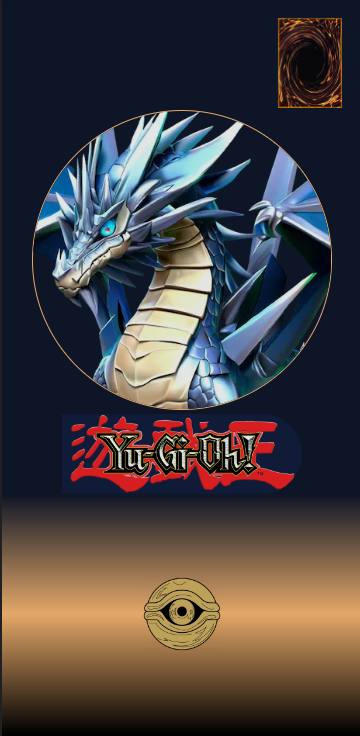
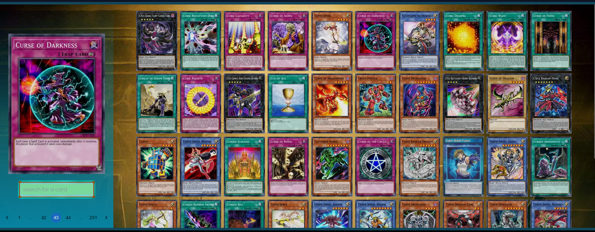
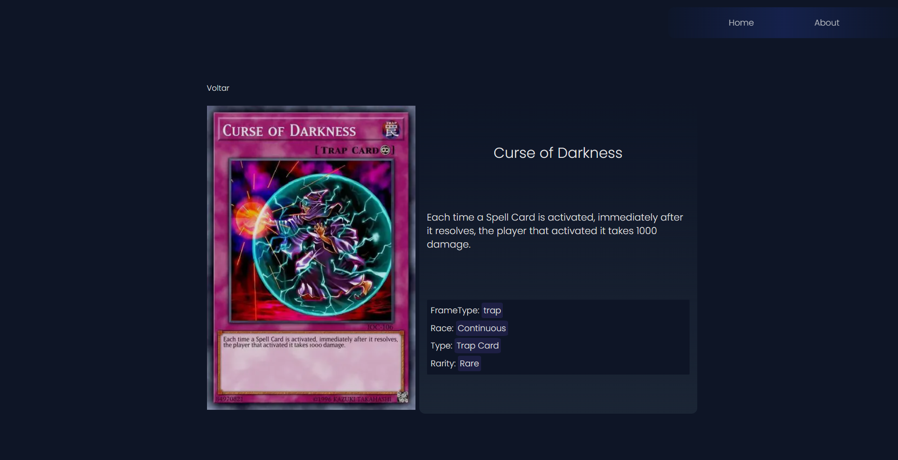

<h1 align='center'> Yougioh Cards pro </h1>

 

>📃 
Bem-vindo! Prepare-se para mergulhar em um mundo repleto de cartas fascinantes! Nosso site oferece um catálogo abrangente de cartas de de Yougioh.

 

<a href='https://yougioh-card-pro.vercel.app' target='blank'>😀=> Yougioh Cards pro <=😀</a>

 

>📃 aqui você tabém pode pesquisar pelo nome de alguma carta (específico) e ao clicar, podendo visualizar com mais detalhes a carta selecionada. A pesquisa pelo nome deve ser feito em inglês.

 

<h2 align='center'> Detalhes da Carta </h2>

<h2 align='center'> API </h2>

 Direitos autorais de <a href='https://ygoprodeck.com/api-guide/' target='blank'>YGOPRODeck.com</a>
API Changelog v7 

 

<h2> 🛠Tecnologias principais usadas </h2>

* React
* Css / Tailwindcss
* Html
* Javascript / Typescript
* Nextjs

<h2 align='center'> Meus contatos </h2>

* [LinkedIn](https://www.linkedin.com/in/romeu-soares-87749a231/)

* romeuindexjs@gmail.com

* WhatsApp: 84 981127596